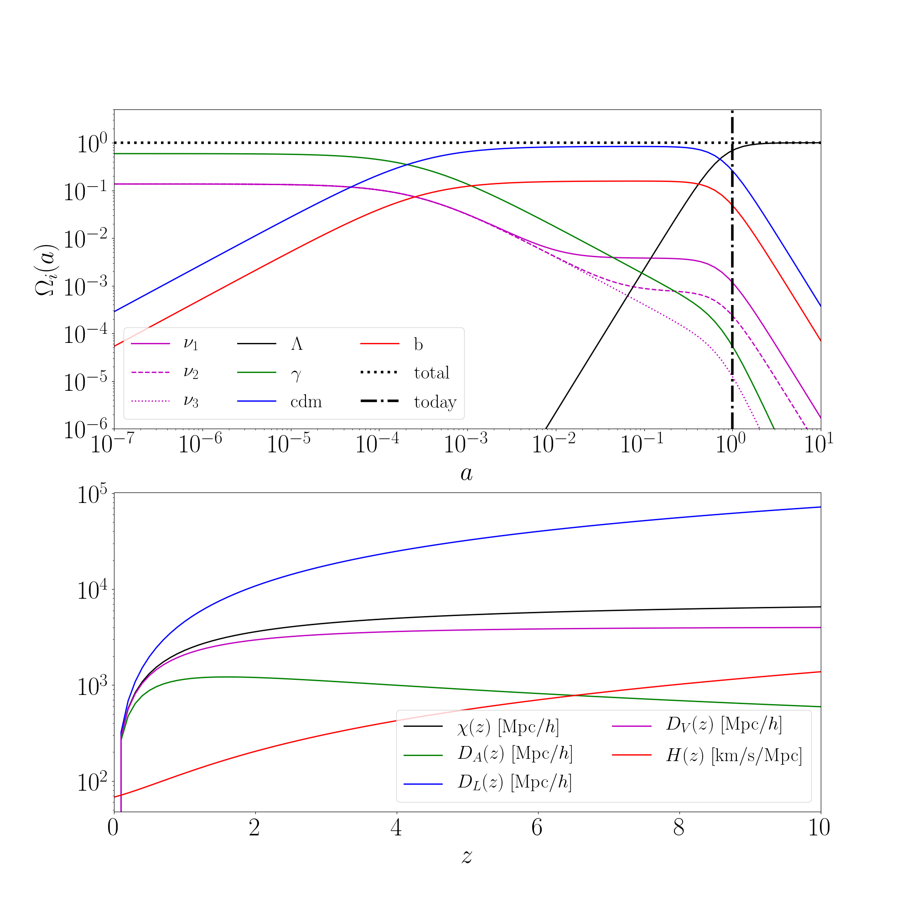
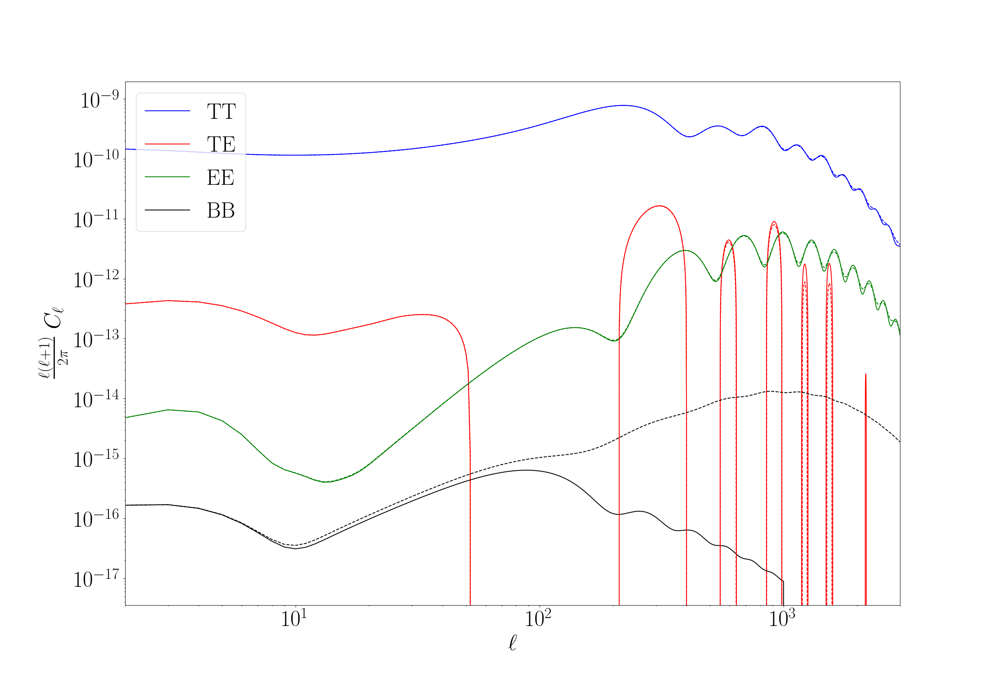

.. _cosmology_test:

Basic usage of cosmological functions
======================================

In this section some basic examples of how to use the class :func:`~colibri.cosmology.cosmo` is shown.
If desired, there is a file in the folder ``tests`` named ``test_cosmology.py`` which can be run as is and provides the exact same results as here.

Print cosmological parameters
-------------------------------

Let us start by importing all the necessary libraries and the ``cosmology`` library.

.. code-block:: python

 import colibri.cosmology as cc
 import matplotlib.pyplot as plt
 import numpy as np

 # Define cosmology instance
 # We report as example all cosmological parameters but the syntax `cc.cosmo()` is sufficient to have all
 # parameters set to default value.
 C = cc.cosmo(Omega_m = 0.3089,       # total matter (CDM + baryons + neutrinos) density parameter today
              Omega_b = 0.0486,       # baryon density parameter today
              Omega_K = 0.,           # Curvature density parameter (Omega_lambda will be set as 1-Omega_K-Omega_m-Omega_b-Omega_gamma
              ns      = 0.9667,       # Scalar spectral index of primordial perturbation
              As      = 2.14e-9,      # Scalar amplitude of primordial perturbation
              sigma_8 = None,         # Power spectrum normalization (set to None as As is defined)
              h       = 0.6774,       # Hubble parameter in units of 100 km/s/Mpc
              w0      = -1.,          # Dark energy parameter of state today
              wa      = 0.,           # Evolution of dark energy parameter of state
              tau     = 0.06,         # Optical depth to reionization
              T_cmb   = 2.7255,       # CMB temperature today (fixes Omega_gamma)
              M_nu    = [0.05, 0.01], # Neutrino masses in eV: in this case we have 2 massive neutrinos
              N_nu    = 3,            # Total number of neutrino species
              N_eff   = 3.046)        # Effective number of neutrinos: since 2 are massive, only N_eff - massive_nu will be massless

Now we print some of the set and derived cosmological parameters

.. code-block:: python

 print("Omega matter:         %.4f" %(C.Omega_m))
 print("Omega CDM:            %.4f" %(C.Omega_cdm))
 print("Omega baryons:        %.4f" %(C.Omega_b))
 print("Omega curvature:      %.4f" %(C.Omega_K))
 print("Omega Lambda:         %.3e" %(C.Omega_lambda))
 print("Omega photons:        %.3e" %(C.Omega_gamma))
 print("Neutrino masses (eV): ", C.M_nu)
 print("Omega neutrino:       ", C.Omega_nu)
 print("Total omega neutrino: %.3e" %(np.sum(C.Omega_nu)))
 print("Massive neutrinos:    %i" %(C.massive_nu))
 print("Massless neutrinos:   %.3f" %(C.massless_nu))
 print("Total neutrinos:      %i" %(C.N_nu))
 print("Effective neutrinos:  %.3f" %(C.N_eff))
 print("Primordial amplitude: %.3e" %(C.As))
 print("Spectral index:       %.4f" %(C.ns))

that will generate the following output

.. code-block:: python

 Omega matter:         0.3089
 Omega CDM:            0.2589
 Omega baryons:        0.0486
 Omega curvature:      0.0000
 Omega Lambda:         6.910e-01
 Omega photons:        5.385e-05
 Neutrino masses (eV): [0.05 0.01 0.  ]
 Omega neutrino:       [1.17136282e-03 2.34683326e-04 1.24179130e-05]
 Total omega neutrino: 1.418e-03
 Massive neutrinos:    2
 Massless neutrinos:   1.046
 Total neutrinos:      3
 Effective neutrinos:  3.046
 Primordial amplitude: 2.140e-09
 Spectral index:       0.9667

Evolution of cosmological parameters and distances
--------------------------------------------------

If one wants to compute the evolution of density parameters in redshift, the following code may be helpful

.. code-block:: python

 # Scale factors and redshifts
 aa = np.geomspace(1e-7, 10, 101) # Scale factors (101 elements from a = 10^-7 to the future a = 10!)
 zz = C.redshift(aa)              # Corresponding redshifts

 # Omegas as functions of z
 onz0 = C.Omega_nu_z(zz)                          # Neutrino density parameters
 ocz0 = C.Omega_cdm_z(zz)                         # Cold dark matter evolution
 obz0 = C.Omega_b_z(zz)                           # Baryons evolution
 olz0 = C.Omega_lambda_z(zz)                      # Dark energy
 ogz0 = C.Omega_gamma_z(zz)                       # Radiation evolution
 okz0 = C.Omega_K_z(zz)                           # Curvature evolution
 otz0 = np.sum(onz0, axis=0)+olz0+ocz0+obz0+ogz0  # Total energy (should be always = 1!)

Also distances can be easily computed:

.. code-block:: python

 # Distances and Hubble parameter as function of redshift
 # `massive_nu_approx = True` is a flag that approximate neutrinos as matter
 # (it is faster, but less accurate; anyway the error is much smaller than 0.1% at z < 10.
 zzz   = np.linspace(0., 10., 101)
 d_com = C.comoving_distance(zzz, massive_nu_approx = True)
 d_ang = C.angular_diameter_distance(zzz, massive_nu_approx = True)
 d_lum = C.luminosity_distance(zzz, massive_nu_approx = True)
 d_vol = C.isotropic_volume_distance(zzz, massive_nu_approx = True)
 H_z   = C.H(zzz)

Plotting everything would generate

Power spectra
-------------------------------------

Generating power spectra requires the installation of the Python wrapper of `CAMB <https://camb.info/>`_ or `Class <http://class-code.net/>`_ , unless the Eisenstein-Hu formula is used (for which the function :func:`~colibri.cosmology.cosmo.EisensteinHu_Pk` is provided).

Generating linear matter power spectra is as easy as typing

.. code-block:: python

 # Generate power spectra at scales and redshifts at default value
 # (z=0 and k = np.logspace(-4., 2., 1001))
 k_camb,  pk_camb  = C.camb_Pk()
 k_class, pk_class = C.class_Pk()
 k_eh,    pk_eh    = C.EisensteinHu_Pk()

In this case, each line returns two things:

 * an array of scales (the same as the input)

 * a 2D array of shape ``(len(z), len(k))`` containing the total matter power spectrum at the required redshifts and scales

It may happen that, instead of the total matter, the linear cold dark matter only power spectrum is required.
In this case, the routines :func:`~colibri.cosmology.cosmo.camb_XPk` and :func:`~colibri.cosmology.cosmo.class_XPk` will do:

.. code-block:: python

 # Generate CDM linear power spectra at scales and redshifts at default value
 # (z=0 and k = np.logspace(-4., 2., 1001))
 k_camb,  pk_camb  = C.camb_XPk(var_1 = ['cdm'], var_2 = ['cdm'])
 k_class, pk_class = C.class_XPk(var_1 = ['cdm'], var_2 = ['cdm'])

Each ``pk`` is a dictionary with keys ``['`var_1`-`var_2`']``: each key is in turn a 2D array of shape ``(len(z), len(k))``.
The latter functions can also be used to compute cross-spectra: for example, with the line

.. code-block:: python

 k_camb,  pk_camb  = C.camb_XPk(var_1 = ['cb', 'nu'], var_2 = ['cb', 'nu'])

the quantity ``pk_camb`` is a dictionary with keys ``['cb-cb']``, ``['nu-nu']``, ``['cb-nu']``, ``['nu-cb']`` containing the cold dark matter plus baryons autospectrum, the neutrino autospectrum and the cross-spectrum between the two (notice that ``'cb-nu'`` and ``'nu-cb'`` give the same result).

The file named ``test_pk.py`` in the ``tests`` folder contains different well-documented examples of how this can be done.
This is an example of computing the linear total matter power spectrum at :math:`z=0` with 3 different methods

.. image:: ../_static/linear_spectrum.png
   :width: 700

CMB power spectrum
-------------------------------

Also a routine to compute the CMB spectrum with `Class` is provided.
The syntax is:

.. code-block:: python

 # Compute Cls
 l, Cl = C.class_Cl(l_max = 3000,
                    do_tensors = True,
                    lensing = True,
                    l_max_tensors = 1000)

 # Separate components
 # T = temperature
 # E = scalar polarization modes
 # B = tensor polarization modes
 # '-lensed' contain lensing effect)
 ClTT   = Cl['TT']
 ClTE   = Cl['TE']
 ClEE   = Cl['EE']
 ClBB   = Cl['BB']
 ClTT_l = Cl['TT-lensed']
 ClTE_l = Cl['TE-lensed']
 ClEE_l = Cl['EE-lensed']
 ClBB_l = Cl['BB-lensed']

The result is

