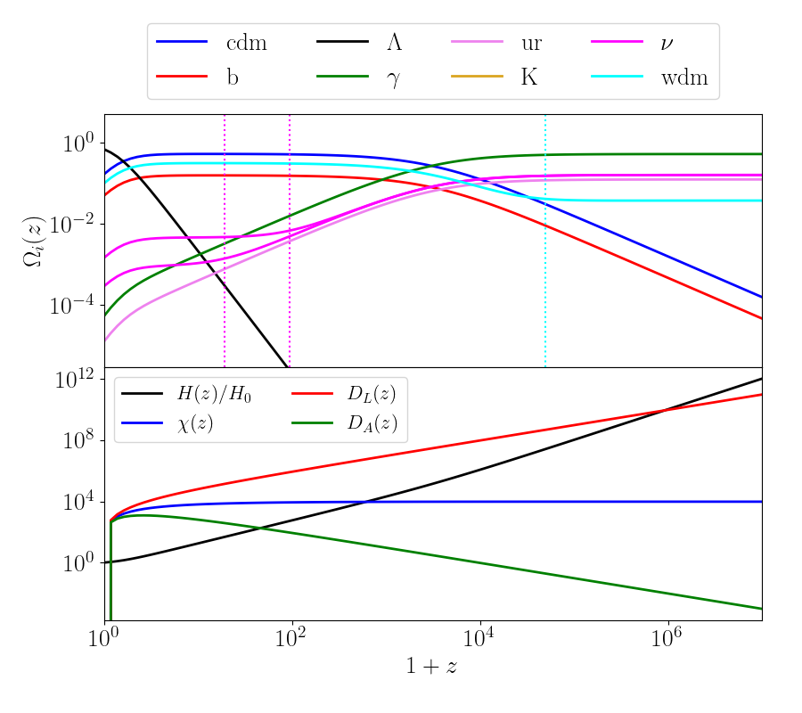

.. _cosmology_test:

Basic usage of cosmological functions
======================================

In this section some basic examples of how to use the class :func:`colibri.cosmology.cosmo` is shown.
If desired, there is a file in the folder ``tests`` named ``test_cosmology.py`` and a notebook ``test_cosmology.ipynb`` in the ``notebooks`` folder. They can be run as they are and provide similar results to here.

Print cosmological parameters
-------------------------------

Let us start by importing all the necessary libraries and the :func:`colibri.cosmology` library.

.. code-block:: python

 import colibri.cosmology as cc
 import matplotlib.pyplot as plt
 import numpy as np

 # Define cosmology instance
 # We report as example all cosmological parameters but the syntax `cc.cosmo()` is sufficient to have all
 # parameters set to default value.
 C  = cc.cosmo(Omega_m   = 0.32,        # Total matter density today
               Omega_b   = 0.05,        # Baryonic matter density today
               As        = 2.1265e-9,   # Amplitude of primordial fluctuations
               sigma_8   = None,        # Power spectrum normalization (set to None as As is defined)
               ns        = 0.96,        # Index of primordial fluctuations
               h         = 0.67,        # Hubble parameter
               Omega_K   = 0.0,         # Curvature parameter (Omega_lambda will be set as 1 minus the rest)
               w0        = -1.0,        # Dark energy parameter of state today (CPL parametrization)
               wa        = 0.0,         # Variation of dark energy parameter of state (CPL parametrization)
               T_cmb     = 2.7255,      # CMB temperature in K
               N_eff     = 3.044        # Effective number of relativistic species in the early Universe
               N_nu      = 3,           # Number of active neutrinos (integer)
               M_nu      = [0.05,0.01], # List of neutrino masses in eV
               M_wdm     = [10.],       # List of WDM species masses in eV
               Omega_wdm = [0.1])       # List of WDM density parameters

Now we print some of the set and derived cosmological parameters

.. code-block:: python

 print("    Matter")
 print("        Omega_m           : %.6f" %C.Omega_m)
 print("        Omega_cdm         : %.6f" %C.Omega_cdm)
 print("        Omega_b           : %.6f" %C.Omega_b)
 print("        Omega_nu          : %s" %(''.join(str(C.Omega_nu))))
 print("        Omega_wdm         : %s" %(''.join(str(C.Omega_wdm))))
 print("    Relativistic species")
 print("        T_cmb             : %.6f K" %C.T_cmb)
 print("        Omega_gamma       : %.6f" %C.Omega_gamma)
 print("        Omega_ur          : %.6f" %C.Omega_ur)
 print("    Dark energy")
 print("        Omega_DE          : %.6f" %C.Omega_lambda)
 print("        w0                : %.6f" %C.w0)
 print("        wa                : %.6f" %C.wa)
 print("    Curvature")
 print("        Omega_K           : %.6f" %C.Omega_K)
 print("        K                 : %.6f (h/Mpc)^2" %C.K)
 print("    Hubble expansion")
 print("        h                 : %.6f" %C.h)
 print("        H0                : %.6f km/s/Mpc" %C.H0)
 print("    Initial conditions")
 print("        As                : %.6e" %C.As)
 print("        ns                : %.6f" %C.ns)))

that will generate the following output

.. code-block:: python

 Matter
        Omega_m           : 0.320000
        Omega_cdm         : 0.146285
        Omega_b           : 0.050000
        Omega_nu          : [0.00888825 0.01481373]
        Omega_wdm         : [0.1]
 Relativistic species
        T_cmb             : 2.725500 K
        Omega_gamma       : 0.000055
        Omega_ur          : 0.000013
 Dark energy
        Omega_DE          : 0.679945
        w0                : -1.000000
        wa                : 0.000000
 Curvature
        Omega_K           : 0.000000
        K                 : -0.000000 (h/Mpc)^2
 Hubble expansion
        h                 : 0.670000
        H0                : 67.000000 km/s/Mpc
 Initial conditions
        As                : 2.126500e-09
        ns                : 0.960000

Evolution of cosmological parameters and distances
--------------------------------------------------

If one wants to compute the evolution of density parameters in redshift, the following code may be helpful

.. code-block:: python

 # Redshifts
 zz = np.geomspace(1., 1e7, 101)-1

 Omega_de    = C.Omega_lambda_z(zz)
 Omega_cdm   = C.Omega_cdm_z(zz)
 Omega_b     = C.Omega_b_z(zz)
 Omega_gamma = C.Omega_gamma_z(zz)
 Omega_K     = C.Omega_K_z(zz)
 Omega_wdm   = C.Omega_wdm_z(zz)
 Omega_nu    = C.Omega_nu_z(zz)
 Omega_ur    = C.Omega_ur_z(zz)

Also distances can be easily computed:

.. code-block:: python

 # Distances and Hubble parameter as function of redshift
 # `massive_nu_approx = True` is a flag that approximate neutrinos as matter
 # (it is faster, but less accurate; anyway the error is much smaller than 0.1% at z < 10.
 Hz          = C.H(zz)
 DC          = C.comoving_distance(zz)
 DL          = C.luminosity_distance(zz)
 DA          = C.angular_diameter_distance(zz)

Plotting these quantities would generate

Power spectra
-------------------------------------

Generating power spectra requires the installation of the Python wrapper of `CAMB <https://camb.info/>`_ or `Class <http://class-code.net/>`_ , unless the Eisenstein-Hu formula is used (for which the function :func:`colibri.cosmology.cosmo.EisensteinHu_Pk` is provided).

Generating linear matter power spectra is as easy as typing

.. code-block:: python

 # Generate power spectra at scales and redshifts at default value
 # (z=0 and k = np.logspace(-4., 2., 1001))
 k_camb,  pk_camb  = C.camb_Pk()
 k_class, pk_class = C.class_Pk()
 k_eh,    pk_eh    = C.EisensteinHu_Pk()

In this case, each line returns two things:

 * an array of scales (the same as the input)

 * a 2D array of shape ``(len(z), len(k))`` containing the total matter power spectrum at the required redshifts and scales

It may happen that, instead of the total matter, the linear cold dark matter only power spectrum is required.
In this case, the routines :func:`colibri.cosmology.cosmo.camb_XPk` and :func:`colibri.cosmology.cosmo.class_XPk` will do:

.. code-block:: python

 # Generate CDM linear power spectra at scales and redshifts at default value
 # (z=0 and k = np.logspace(-4., 2., 1001))
 k_camb,  pk_camb  = C.camb_XPk(var_1 = ['cdm'], var_2 = ['cdm'])
 k_class, pk_class = C.class_XPk(var_1 = ['cdm'], var_2 = ['cdm'])

Each ``pk`` is a dictionary with keys ``['`var_1`-`var_2`']``: each key is in turn a 2D array of shape ``(len(z), len(k))``.
The latter functions can also be used to compute cross-spectra: for example, with the line

.. code-block:: python

 k_camb,  pk_camb  = C.camb_XPk(var_1 = ['cb', 'nu'], var_2 = ['cb', 'nu'])

the quantity ``pk_camb`` is a dictionary with keys ``['cb-cb']``, ``['nu-nu']``, ``['cb-nu']``, ``['nu-cb']`` containing the cold dark matter plus baryons autospectrum, the neutrino autospectrum and the cross-spectrum between the two (notice that ``'cb-nu'`` and ``'nu-cb'`` give the same result).

The file named ``test_pk.py`` in the ``tests`` folder or the notebook ``test_pk.ipynb`` in the ``notebooks`` folder contains different well-documented examples of how this can be done.
This is an example of computing the linear total matter power spectrum at :math:`z=0` with 3 different methods

.. image:: ../_static/linear_spectra.png
   :width: 700

