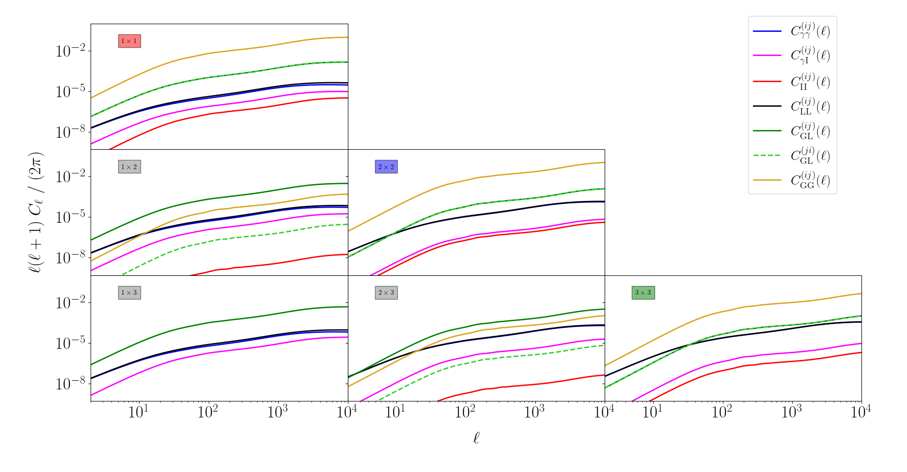

.. _limber_test:

Power spectra in Limber's approximation
========================================

Here is shown an example of how to compute shear and galaxy power spectra using the class :func:`colibri.limber.limber` .
In a flat Universe such spectra are given by:

.. math::

 C_{AB}^{(ij)}(\ell) = \int_{z_\mathrm{min}}^{z_\mathrm{max}} dz \ \frac{c}{H(z)} \ \frac{W_A^{(i)}(z) W_B^{(j)}(z)}{\chi^2(z)} \ P\left(k = \frac{\ell}{\chi(z)}, z\right),

where :math:`A` and :math:`B` can either be weak lensing or galaxy clustering. In an ideal case :math:`z_\mathrm{min}=0` and :math:`z_\mathrm{max}=\infty`, :math:`W_A^{(i)}(z)` is the window function for a given redshift bin and :math:`P(k,z)` is the total matter non-linear power spectrum.

Initialization
---------------

To start, initialize a :func:`colibri.cosmology.cosmo` instance and assign it to a :func:`colibri.limber.limber` instance.

.. code-block:: python

 import colibri.cosmology as cc
 import colibri.limber as LL
 C = cc.cosmo()
 S = LL.limber(cosmology = C, z_limits = [0.01, 5.])

The quantity ``z_limits`` tells the code which are the limits of integration.

Power spectrum
---------------

As we saw, there are two main ingredients for the Limber approximation, namely the power spectra and the window functions.

The former is loaded through the following lines

.. code-block:: python

 kk = np.geomspace(1e-4, 1e2, 301)
 zz = np.linspace(0., 5., 51)
 _, pkz = C.camb_Pk(z = zz, k = kk, nonlinear = True, halofit = 'mead2020')
 S.load_power_spectra(z = zz, k = kk, power_spectra = pkz)

where first we generate a table of power spectra. These must have the dimensions ``(len(z), len(k))`` and in this case ``k`` and ``z`` must be the scales and redshifts at which that array is computed.

Bins, galaxy distributions and window functions
------------------------------------------------------

The window functions depend on the source galaxy distributions.

As a simple example, we assume a distribution given by :func:`colibri.limber.limber.euclid_distribution`, with 3 redshift bins with edges [0, 0.71], [0.71, 1.11], [1.11, 5].
The window functions are loaded with the following lines

.. code-block:: python

 # Set bins
 bin_edges = [0.01,0.71,1.11,5.00]
 nbins     = len(bin_edges)-1
 # Set galaxy distribution (can be different for different probes!)
 z_gal     = np.linspace(S.z_min, S.z_max, 201)
 nz_gal    = [S.euclid_distribution_with_photo_error(z=z_gal,
                                                    zmin=bin_edges[i],
                                                    zmax=bin_edges[i+1]) for i in range(nbins)]

 # Compute the window functions for the Limber power spectra
 # Cosmic shear
 S.load_shear_window_functions  (z       = z_gal,
                                 nz      = nz_gal,
                                 name    = 'shear')
 # Intrinsic alignment alone
 S.load_IA_window_functions     (z       = z_gal,
                                 nz      = nz_gal,
                                 A_IA    = 1.72,
                                 eta_IA  = -0.41,
                                 beta_IA = 2.17,
                                 lum_IA  = lambda z: (1+z)**-0.5,
                                 name    = 'IA')
 # Lensing (shear + intrinsic alignment)
 # (Notice that the sum of the previous two should give the same result of the following,
 # so the three of them are all computed here for didactic purposes.)
 S.load_lensing_window_functions(z       = z_gal,
                                 nz      = nz_gal,
                                 A_IA    = 1.72,
                                 eta_IA  = -0.41,
                                 beta_IA = 2.17,
                                 lum_IA  = lambda z: (1+z)**-0.5,
                                 name    = 'lensing')
 # Galaxy clustering
 z_mean = (np.array(bin_edges[:-1])+np.array(bin_edges[1:]))*0.5
 bias   = (1.+z_mean)**0.5
 S.load_galaxy_clustering_window_functions(z = z_gal, nz = nz_gal, bias = bias, name = 'galaxy')

 # Other window functions are implemented and custom window functions can also be used!
 # e.g. the HI brightness temperature, the CMB lensing and the galaxy number counts
 #S.load_HI_window_functions         (z=z_gal,nz=nz_gal,bias=1,Omega_HI=0.000625,name='HI')
 #S.load_CMB_lensing_window_functions(z=z_gal,nz=nz_gal,z_LSS=1089,name='CMB')
 #S.load_custom_window_functions     (z=z_gal,window=nz_gal,name='counts')

Each function called adds a key to the dictionary ``self.window_function``

.. warning::

 It is assumed here that the window functions are independent from scales. If this is not the case, typically the scale-dependence can be easily factorized out (e.g. ISW effect, different orders of cosmological perturbation theory...) and put in the power spectrum.

Angular power spectra
-------------------------------

Finally, the shear power spectrum is computed with

.. code-block:: python

 ll    = np.geomspace(2., 1e4, 51)
 Cl    = S.limber_angular_power_spectra(l = ll, windows = None)

The keys of the output ``Cl`` are combinations of window functions used, e.g. ``Cl['shear-shear']`` or ``Cl['galaxy-lensing']``.

Angular correlation functions
------------------------------

Equivalently, the angular correlation functions can be computed with

.. warning::

 Unfortunately the correlation functions can be computed for single angular power spectrum at a time, because different windows require different orders for the Hankel transform.

.. code-block:: python

 ll    = np.geomspace(2., 1e4, 128)
 Cl    = S.limber_angular_power_spectra(l = ll)
 theta = np.geomspace(10., 800., 51) 
 xi    = {}
 for key in Cl.keys():
        if   key in ['lensing-lensing', 'shear-shear', 'shear-IA', 'IA-shear', 'IA-IA']:
            order_plus, order_minus = 0, 4
            xi[key+' +'] = S.limber_angular_correlation_functions(theta, ll, Cl[key], order_plus)
            xi[key+' -'] = S.limber_angular_correlation_functions(theta, ll, Cl[key], order_minus)
        elif key in ['lensing-galaxy', 'galaxy-lensing']:
            order = 2
            xi[key] = S.limber_angular_correlation_functions(theta, ll, Cl[key], order)
        elif key == 'galaxy-galaxy':
            order = 0
            xi[key] = S.limber_angular_correlation_functions(theta, ll, Cl[key], order)

