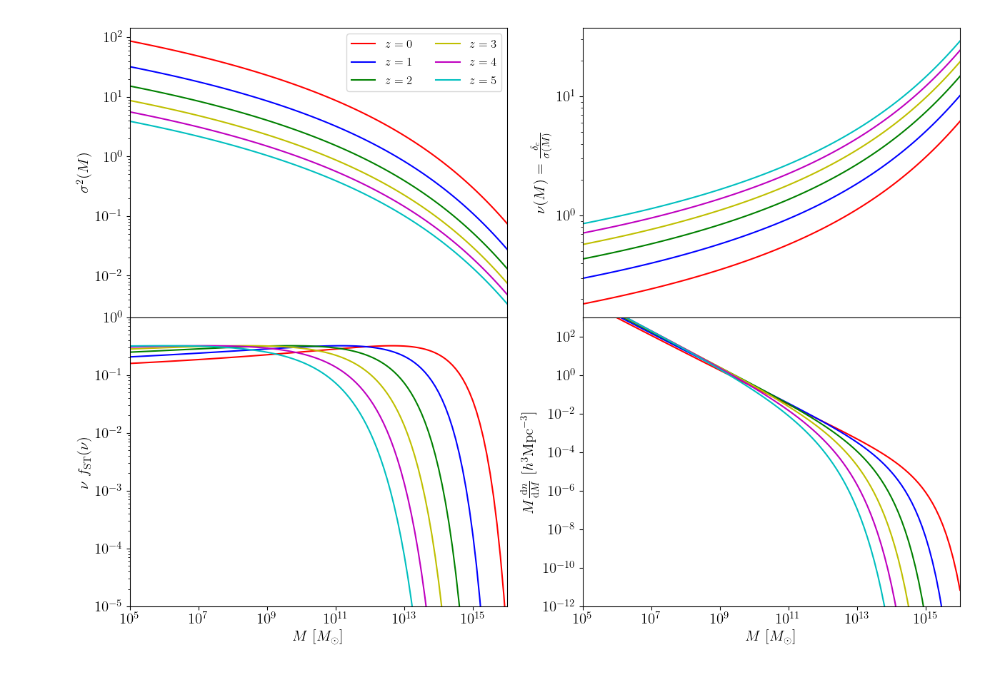

.. _mass_function_test:

Halo mass function
======================================

In this section we show how to compute the halo mass functions using the class :func:`colibri.cosmology.cosmo`
We also provide alternatives to the test code.
The text below refers to the file named ``test_mass_function.py`` provided in the ``tests`` directory or similarly to ``test_mass_function.ipynb`` provided in the ``notebooks`` folder.

Initialization
-------------------------------

First of all, let us define scales, redshifts, masses and a :func:`colibri.cosmology.cosmo` instance.
Also, we load the linear power spectra, which are necessary to compute mass functions and related quantities.

.. code-block:: python

 import colibri.cosmology as cc
 import matplotlib.pyplot as plt
 import numpy as np

 C=cc.cosmo()

 zz   = np.linspace(0., 5., 6)
 kk   = np.logspace(-4.,2.,1001)
 logM = np.linspace(5.,16.,111)
 nz, nk, nm = len(np.atleast_1d(zz)), len(np.atleast_1d(kk)), len(np.atleast_1d(logM))

 # Load linear power spectra
 k,pk=C.camb_Pk(z=zz)

Mass variances, peak height and mass functions
-----------------------------------------------

The :func:`colibri.cosmology.cosmo` class has routines able to compute many interesting quantities for galaxy clustering.
In particular, the mass variance in spheres, the peak height for the computation of peak-background split and the halo mass function itself.

.. code-block:: python

 sigma_squared = C.mass_variance(logM = logM, k = k, pk = pk)                                 # mass variance in spheres
 nu_peak       = C.peak_height(logM = logM, k = k, pk = pk)                                   # peak-background split
 ShethTormen   = C.ShethTormen_mass_function(sigma = sigma_squared**0.5, a = 0.707, p = 0.3)  # Sheth-Tormen function
 HMF           = C.halo_mass_function(logM = logM, k = k, pk = pk, mass_fun = 'ShethTormen')  # halo mass function

These 4 quantities return 2D arrays (one dimension is redshift, the other is mass/peak height).
If one wants to plot all the previous quantities, the following picture is the result.

