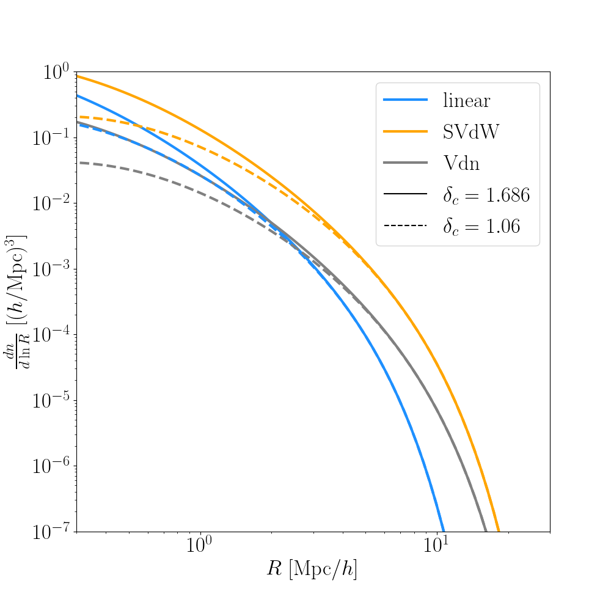

.. _void_size_function_test:

Void size function
=============================================

The excursion set model is not the only way to compute the void size function.
The following code refers to the file ``test_void_size_function.py`` provided in the ``tests`` directory.

We first set the radii at which to compute the void size function and the non-linear underdensity threshold.

.. code-block:: python

 RR   = np.geomspace(0.1,50.,101)  # Radii of voids
 DNL  = -0.8                       # Underdensity for voids
 IMAX = 200                        # Max index of sum (must be >= 200)

We then initialize a cosmology with its linear power spectrum at ``z=0``.

.. code-block:: python

 C    = cc.cosmo(Omega_m=0.26,Omega_b=0.044,ns=0.96,As=2.168e-9,h=0.715)
 zz   = 0.
 kk   = np.logspace(-4.,2,1001)
 _,pk = C.camb_Pk(z=zz,k=kk)

We compute the void size function for different models (linear, Sheth-Van der Weygaert and volume conserving):

.. code-block:: python

 RL_L,VSF_L  = C.void_size_function(R=RR,z=zz,k=kk,pk=pk,Delta_NL=DNL,
                                    model = 'linear',max_index=IMAX)
 RL_S,VSF_S  = C.void_size_function(R=RR,z=zz,k=kk,pk=pk,Delta_NL=DNL,
                                    model = 'SvdW'  ,max_index=IMAX)
 RL_V,VSF_V  = C.void_size_function(R=RR,z=zz,k=kk,pk=pk,Delta_NL=DNL,
                                    model = 'Vdn'   ,max_index=IMAX)
 RL_L,VSF_Ll = C.void_size_function(R=RR,z=zz,k=kk,pk=pk,Delta_NL=DNL,
                                    model = 'linear',max_index=IMAX,delta_c=1.06)
 RL_S,VSF_Sl = C.void_size_function(R=RR,z=zz,k=kk,pk=pk,Delta_NL=DNL,
                                    model = 'SvdW'  ,max_index=IMAX,delta_c=1.06)
 RL_V,VSF_Vl = C.void_size_function(R=RR,z=zz,k=kk,pk=pk,Delta_NL=DNL,
                                    model = 'Vdn'   ,max_index=IMAX,delta_c=1.06)

