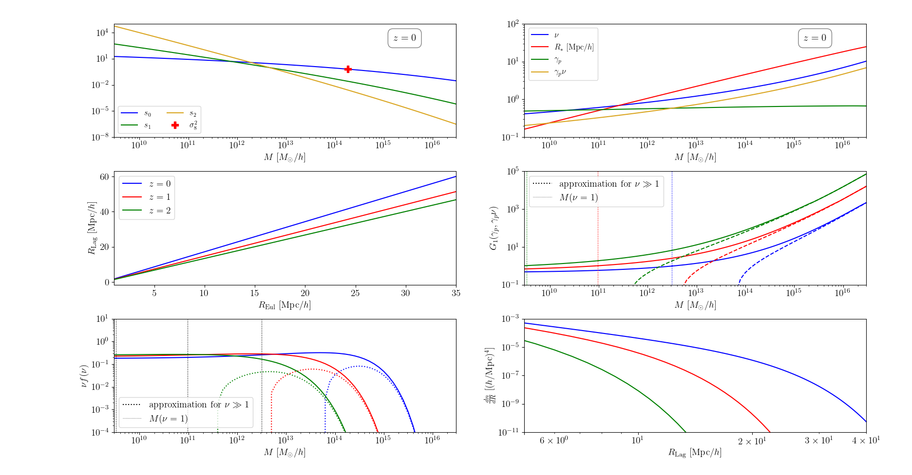

.. _void_size_function_test:

Void size function
======================================

Here we show how to compute the void size functions and some related quantities using the class :func:`~src.cosmology.cosmo`.
The text below refers to the file named ``test_vois_size_function.py`` provided in the ``tests`` directory in the GitHub repository.

Initialization
-------------------------------

Let us define scales, redshifts, masses and radii in the usual way.
We also load power spectra from a defined cosmology.

.. code-block:: python

 import numpy as np
 import colibri.cosmology as cc
 import matplotlib.pyplot as plt

 zz      = [0.,1.,2.]                  # Redshifts
 nz      = len(np.atleast_1d(zz))      # Number of redshifts
 logM    = np.linspace(5., 17., 121)   # Masses
 R_Eul   = np.linspace(1.,35.,69)      # Eulerian radii at which to compute voids
 delta_v = -1.76                       # Linear extrapolation of underdensity for voids at "collapse"

 # Load spectra
 C = cc.cosmo()
 k, pk = C.camb_Pk(z = zz)

Mass variances and useful quantities
-----------------------------------------------

For most of the quantities involved here, their full description can be found in `here <https://arxiv.org/abs/1206.3506>`_ .

We start by computing the moments of the mass variance in spheres. The field is further smoothed by a second Gaussian window function

.. code-block:: python

 # Mass variances multipoles, further smoothed for a Gaussian (useful for voids)
 s0 = C.mass_variance_multipoles(logM=logM,k=k,pk=pk,j=0,smooth=True ,window='th',R_sm=5.5)
 s1 = C.mass_variance_multipoles(logM=logM,k=k,pk=pk,j=1,smooth=True ,window='th',R_sm=5.5)
 s2 = C.mass_variance_multipoles(logM=logM,k=k,pk=pk,j=2,smooth=True ,window='th',R_sm=5.5)

Other key quantities are the following:

.. code-block:: python

 # Transform Eulerian to Lagrangian coordinates
 R_Lag     = np.outer(C.lagrange_to_euler(z = zz),R_Eul)
 # gamma_p and R* parameters
 gamma_p   = s1/np.sqrt(s0*s2)
 R_star    = np.sqrt(3.*s1/s2)
 # Peak (i.e. Trough) height in voids
 dv        = np.abs(delta_v)
 nu        = dv/s0**.5

 # Excursion Set Troughs functions
 G1        = np.array([C.G_n_BBKS(1, gamma_p[iz], nu[iz]) for iz in range(nz)])

 # Press-Schechter formalism for voids
 R_of_M    = C.radius_of_mass(10.**logM) # Radii corresponding to masses
 f_nu      = C.volume_of_radius(R_of_M, 'th')/(2.*np.pi*R_star**2.)**(3./2.)*C.PressSchechter_mass_function(s0**.5, delta_th = dv)/(2.*nu)*G1/(gamma_p*nu)
 # High-mass approximation for Press-Schechter formalism for voids
 f_high_nu = np.exp(-nu**2./2.)/np.sqrt(2.*np.pi)*C.volume_of_radius(R_of_M, 'th')/(2.*np.pi*R_star**2.)**1.5*(nu**3.-3*nu)*gamma_p**3.

Actual computation of void size function
-----------------------------------------------

All of these steps can be skipped if one just wants to compute the void size function.
The summary of all the previous lines is given by:

.. code-block:: python

 # Void size function
 # a,p are Sheth-Tormen parameters
 # delta_v is the linear underdensity for "collapse" of voids
 RL,VSF = C.void_size_function(R=R_Eul,z=zz,k=k,pk=pk,delta_v=-1.76,a=1.,p=0.)

The function :func:`~src.cosmology.cosmo.void_size_function` returns two 2D arrays.
The first contains the Lagrangian radii at which the void size function is evaluated (first dimension is redshift).
The second is the actual void size function evaluated at the given redshift and Lagrangian radius.

